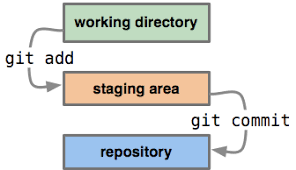

# Git-Foo

Everything you need to know about git, or at least where to find it!

## Git Help

Like any great software, Git has excellent documentation!

There are many ways to learn more about Git and specific tools:

1. From the command-line
	* $ git help \<verb\>
	* $ git \<verb\> --help
	* $ git \<verb\> -h (will output a list of command options)  
	* $ man git-\<ver\>

2. Websites
	* [man-pages](https://git-scm.com)
	* [Git How To](http://githowto.com) (A fun interactive tutorial)

## Git vs Other VCS

## Git Architecture

It's important to understand the basic underlying architecture Git uses. Most Git tools make use of this architecture
and understanding it will allow you to better understand these tools. 

There are three main areas that files move through during the Git flow.

### The Working Directory

This is the project directory on you file system. Nothing super interesting here!

The file can be in two states _tracked_ (meaning Git is versioning that file) and _untracked_ (meaning Git is not versioning the file).

### The Index (Staging Area)

File can be added to the _Index_ using `git add`. This is an area, a file in fact `.git/index`, that sits in between your working directory and repository.
Any files that are in this staging area will be stored in the repository upon running `git commit`. The _Index_ can be used to break changes to several files
into multiple commits if needed.

### The Repository

This is your local Git repository where versions of a file are stored.

## Git UIs

## Git Aliases

## Git Logs

`git log` by default will list all commits in reverse chronological order. I shows the SHA-1 checksum, author's name and e-mail, date written, and the 
commit message.

There are a large number of options you can provide `git log` to customize the output.
* `git log -p` or `git log --patch` - shows the changes added in a each commit.
* `git log --stat` - Shows the status of each commit (files changed and total insertions and deletions).
* `git log --pretty=<options>` - The `pretty` option will modify the output format. There are a few prebuilt options such as `oneline` that can be used.
* `git log --graph` - Adds an ASCII graph showing branch and merge history.
* `git log -S function_name` - Takes a string and shows commits that changed the number of occurences of that string.

Many of the above options, [along with others](https://git-scm.com/docs/pretty-formats), can be added together to produce a very custom `git log` output.

## Git Diffs

`git diff` is a very useful tool for seeing the specific changes between file versions. It can be used in many different ways and understanding the Architecture
we discussed earlier is very helpful.

A very common, maybe the most common, scenario for looking at the differences between files is between your _Working Directory_ and _Index_. This is useful for seeing
the changes you've made to a file(s) before you run `git add`.

Another scenario you may find youself in is wanting to know the changes that you are about to commit to the repository. This can be done with `git diff --cached`.
Running this command will show you the differences of a file(s) between the _Index_ and _Repository_.

If you'd prefer to see the file changes in a GUI, with the full file versions side by side, then check out `git difftool`!

Explore more available options [here](https://git-scm.com/docs/git-diff).

## Git Bisect

`git bisect` - Use binary search to find the commit that introduced a bug.

* `git bisect start` - starts the bisect
* `git bisect bad <commit>` - tell bisect a commit known to contain the bug. Ignoring the commit will default to current commit.
* `git bisect good <commit>` - tell bisect a commit that doesn't contain the bug. \<commit\> can be a commit hash or a tag.

Once the above information is given to `git bisect` it will use a binary search to find the commit that introduced a bug by process of elimination.

It will checkout the commit half way between the `good` and `bad` commits that you initially provided it. You then need to tell `git bisect` if that commit
contains the bug or not.

* `git bisect good` - commit doesn't contain the bug.
* `git bisect bad` - commit does contain the bug.

If you marked the commit as good, then `git bisect` knows the bug was introduced at some point between the current commit and the initial `bad` commit you provided.
If you marked it as bad, then `git bisect` knows the bug was introduced between the initial `good` commit and the current commit.

`git bisect` will then checkout the the commit half way between the two new commits, bases on the result from above.

This process repeats until `git bisect` narrows down the commit that first introduced the bug.

When finished with `git bisect` run `git bisect reset`. This will end the `git bisect` process and checkout the commit you were on prior to starting the process.

`git bisect run my_script arguments` - a script can be used to test whether a commit is `good` or `bad`!

## Git Flow

## Apendix

`git commit -a -m "Commit Message"` - This will automatically commit all changes in you _Working Directory_, skipping the need to `git add` files to the _Index_.
`git mv` - Can be uses to _rename_ or _move_ a file, explicitly teilling get that you did so.
`git rm` - Removes a file from both the _Working Directory_ and _Index_. The file is no longer tracked and will not be in the next commit.
`git rm --cahced` - Removes a file from the _Index_ only. Leaves the file in you _Working Directory_.
